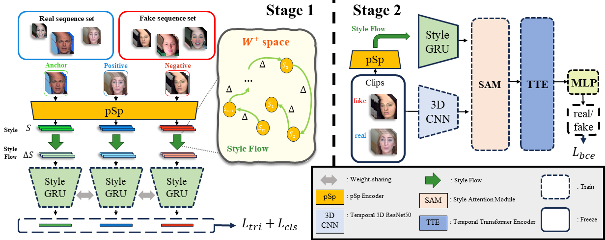

# Exploiting Style Latent Flows for Generalizing Deepfake Video Detection (CVPR 2024)
Jongwook Choi, Taehoon Kim, Yonghyun Jeong, Seungryul Baek, Jongwon Choi*

## Abstract 
> This paper presents a new approach for the detection of fake videos, based on the analysis of style latent vectors and their abnormal behavior in temporal changes in the generated videos. We discovered that the generated facial videos suffer from the temporal distinctiveness in the temporal changes of style latent vectors, which are inevitable during the generation of temporally stable videos with various facial expressions and geometric transformations. Our framework utilizes the StyleGRU module, trained by contrastive learning, to represent the dynamic properties of style latent vectors. Additionally, we introduce a style attention module that integrates StyleGRU-generated features with contentbased features, enabling the detection of visual and temporal artifacts. We demonstrate our approach across various benchmark scenarios in deepfake detection, showing its superiority in cross-dataset and cross-manipulation scenarios. Through further analysis, we also validate the importance of using temporal changes of style latent vectors to improve the generality of deepfake video detection.

## Code 
The public code is under construction. If you need the current version, please send us an e-mail.

## Contact 
If you have any questions, feel free to ask cjw@vilab.cau.ac.kr or choijw@cau.ac.kr.
